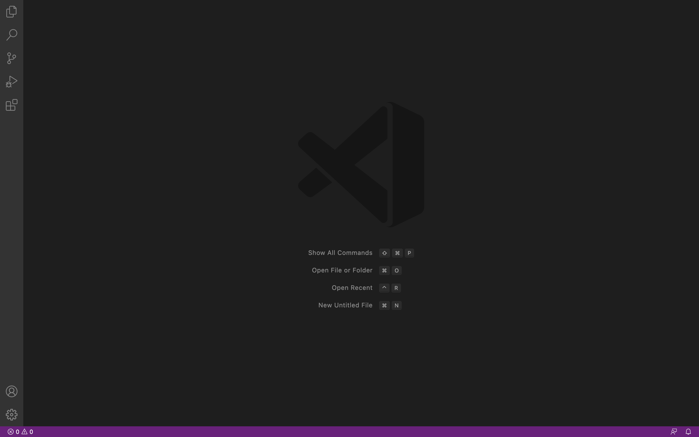
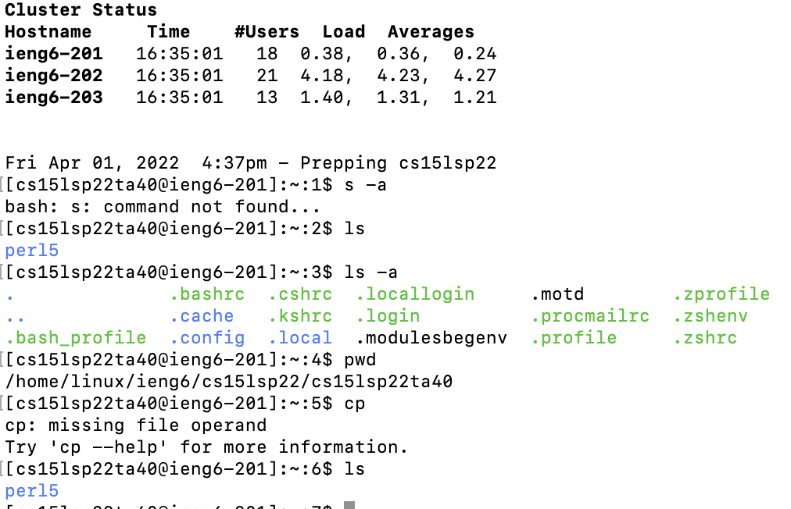
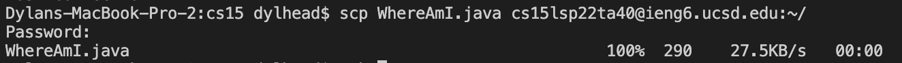
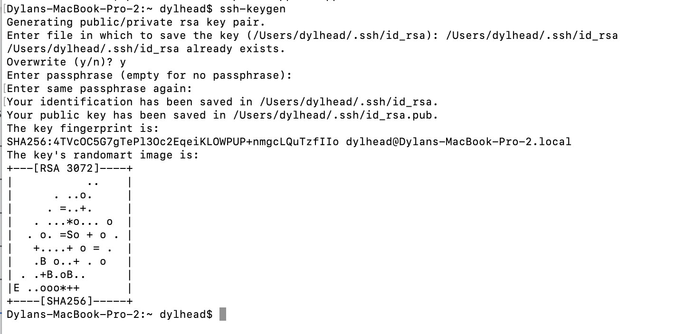
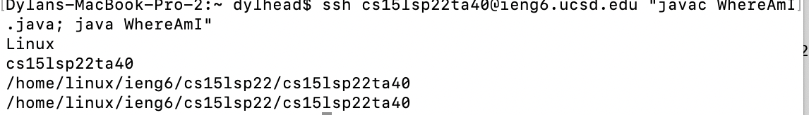

[Home](https://dledermann.github.io/cse15l-lab-reports/)

## Installing VScode

To log into a course-specific account on ieng6 you first want to start by downloading VScode. The link to VScode can be found by clicking [here](https://code.visualstudio.com/download). Following the given steps in the installer and once you finish and open vs code there should be a screen that looks like this:

 

## Remotely Connecting

Once you have VScode downloaded, you are going to want to go to get your course-specific account. To get that you need to go to the website [here](https://sdacs.ucsd.edu/~icc/index.php). Sign in and then under the "Additional Accounts" part there will be links leading to your course-specific account. For CSE 15L you need the account name that starts with cse15lsp22. In your terminal in VScode you want to type in:
```
$ ssh cs15lsp22zz@ieng6.ucsd.edu
```
(This $ simply means in the terminal) But you replace the zz with your letters after sp22. After you will be asked for a password, which if you haven't done one yet, can be created on the website with your course-specific account. If this is your first time logining in, some lines will follow asking you something, so just type yes in the terminal. Once you finish and connect to the ieng6, you will be shown a screen that looks similar to this:


Once you have a screen like this, you are now connected to the ieng6 computer, which are located in the CSE basement. While using this, your computer is referred to as the client and the basement computer is referred to as the server.

## Trying Some Commands

You can try running some commands, such as 
```
> cd
> ls
```

Running the commands will look something like this: 



cd and some directory will go to that directory in the server and ls will list the files of the current server directory you are in. To log out of the server you can either press Ctrl + D on your computer, or type 

```
exit 
```

in the terminal.

## Moving Files with scp

To copy a file from the client to the server, you can type

```
$ scp file-name cs15lsp22zz@ieng6.ucsd.edu :~/
```

Make sure that when you type this command you are on the side that has the file, so if you were to copy the file from your computer to ieng6, you would want to be on the client and not on the server. Once you run the command you will be asked for your password to log into the server. The entire process will look something like:



If your terminal looks like that, then that means that you have successfully copied tohe file. This means that you can now log onto the server and run the file using java and javac.

## Setting an SSH Key

Having to type your password into the terminal everytime you want to log into the server can be tiring. Using an SSH key, you can log into the server without having to type your password. To do so, you want to have your terminal on the client side. What you want to run is:

```
$ ssh-keygen
```

```
Enter file in which to save the key (/Users/user-name/.ssh/id_rsa): /Users/user-name/.ssh/id_rsa
```

Whhen you are asked to enter the file to save the key to, you are entering the part above after the colon, but you are replacing user-name with the name of the current user. You will be asked if you want a passphrase and type nothing and press enter twice to avoid needing a passphrase. You will then be given a key fingerprint and a the key's randomart image. The entire process will look something like:



This made a private key and a public key on your computer in your .ssh directory with the files that are named id_rsa. Now, you copy the public key, file ends with .pub, onto the server. To copy the public key onto the server, you want to log onto the server again using .ssh. Once on the server, you want to type in the terminal:

```
$ mkdir .ssh
```

Log out of the server after that, then on the client side you want type in the terminal: 

```
$ scp /Users/user-name/.ssh/id_rsa.pub cs15lsp22zz@ieng6.ucsd.edu:~/.ssh/authorized_keys
```

You are replacing user-name with you computer user name and you are replacing zz after 22 with the last letter of your course-specific account. This will copy the file with your id from the client onto the server and you should now be able to log onto the server without needing your password.


## Optimizing Remote Running

One thing you can do when logining into the server is you can add commands at the end of the .ssh line by putting the commands in quotes. Doing so will make the command run after logining into the server. You can also run multiple commands by separating the commands by a semicolon. An example of using all of this information would be: 

```
$ ssh cs15lsp22zz@ieng6.ucsd.edu "ls; javac testFile.java; java testFile"
```
This line in the command terminal will log you into the server, then list the files in the current directory, then compile a file named testFile.java, and then run the file that was just compiled. All this is done using only one line of code and allows you to perform multiple actions in only one line in the terminal. For example, if there is a file called WhereAmI that gives the current directory you are in, you can run the command above with the file and it will show where you are. Doing so will look something like:

