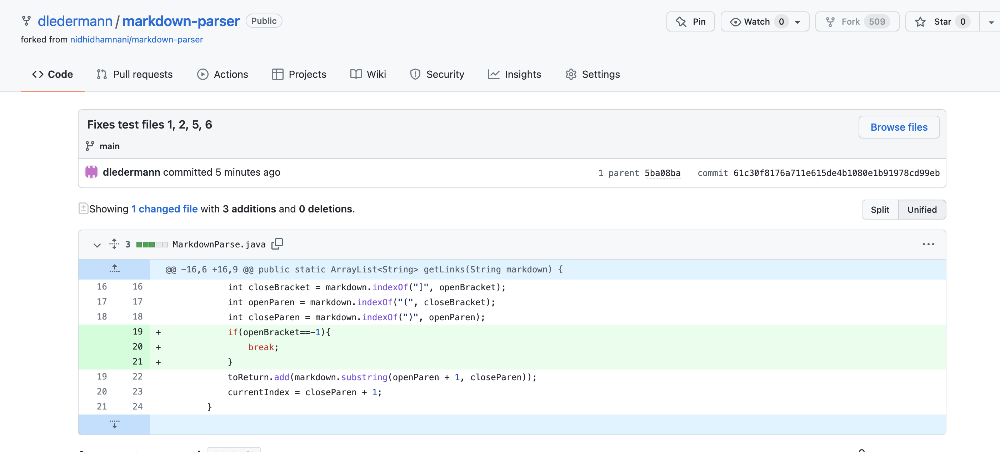
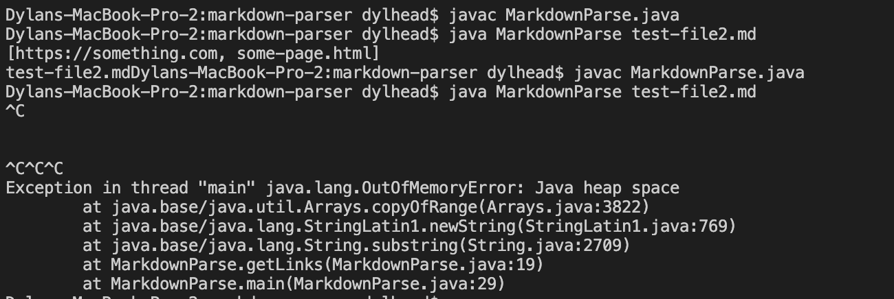
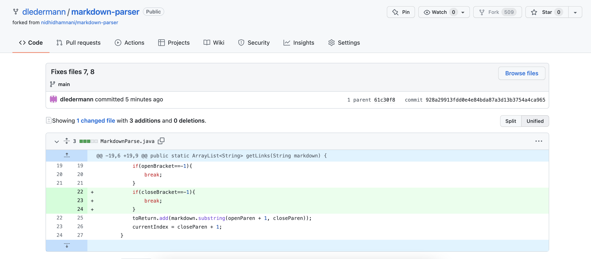
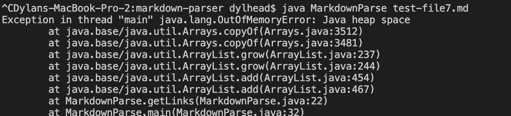
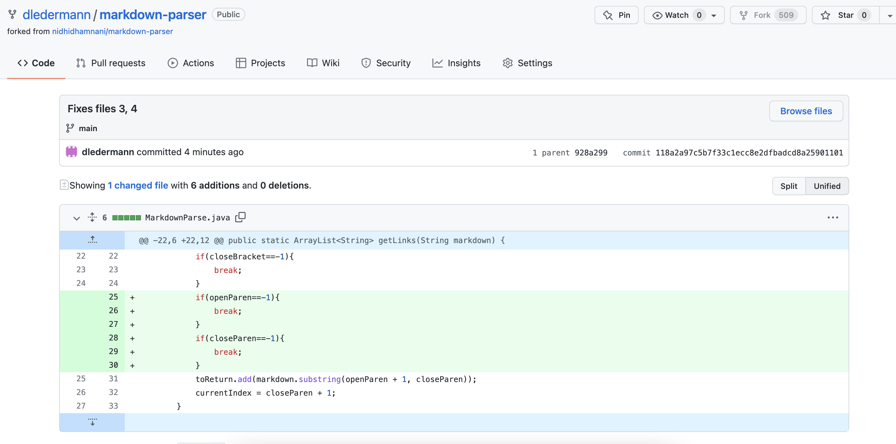
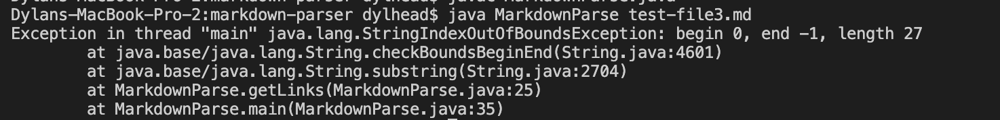

[Home](https://dledermann.github.io/cse15l-lab-reports/)

## Bug Fix 1

[Failure-Inducing Test File](https://github.com/dledermann/markdown-parser/blob/main/test-file2.md)

The relationship between the bug, the symptom, and the failure-inducing input is that the failure inducing input causes the code to loop forever, which causes the symptom of all the memory being used to run the code. This happens, because originally, the loop only ends if the last character in the file is a closed parenthesis, because a file like so would cause the variable currIndex to be equal to the index of that last closed parenthesis + 1, which makes it greater than the length of the file and ends the loop. This doesn't happen in test-file2.md, because the test file doesn't end with a close parenthesis. 

## Bug Fix 2

[Failure-Inducing Test File](https://github.com/dledermann/markdown-parser/blob/main/test-file7.md)

The relationship between the bug, the symptom, and the failure-inducing input is that the failure inducing input causes a loop in the code to loop infinitely, which is the bug, and then the symptom from this bug is that the memory storage gets filled up, causing the code to crash. This happens, because the only ways for the loop to stop is if the last character is a closed parenthesis, or if there is an opened bracket, followed by a closed parenthesis. The first loop stop was already described, and the second loop stop occurs, because of the if statement in the loop that stops the loop if openBracket is -1, but openBracket can only be -1 if there is a closed parenthesis sometime after it. Since the test file that was used is a closed parenthesis followed by an open bracket, none of the conditions to stop the loop occur, causing the loop to keep looping.

## Bug Fix 3

[Failure-Inducing Test File](https://github.com/dledermann/markdown-parser/blob/main/test-file3.md)

The relationship between the bug, the symptom, and the failure-inducing input is that the input causes the bug of closeParen and openParen are set to -1, because the file doesn't have a any parenthesis. Since both of those variables are -1, when the code tries to substring markdown using closeParen, which is -1, an IndexOutOfBounds error occurs, because you can't substring something from 0 to -1, because -1 isn't an index in the string. The IndexOutOfBounds error is the symptom from this bug, because that is the output of the code trying to run.
