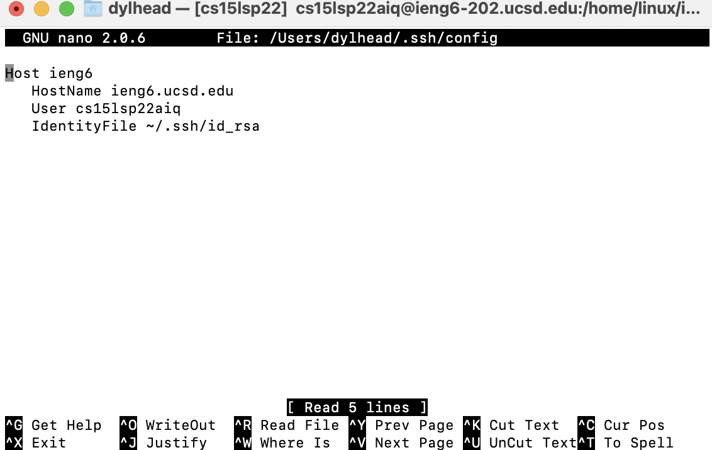
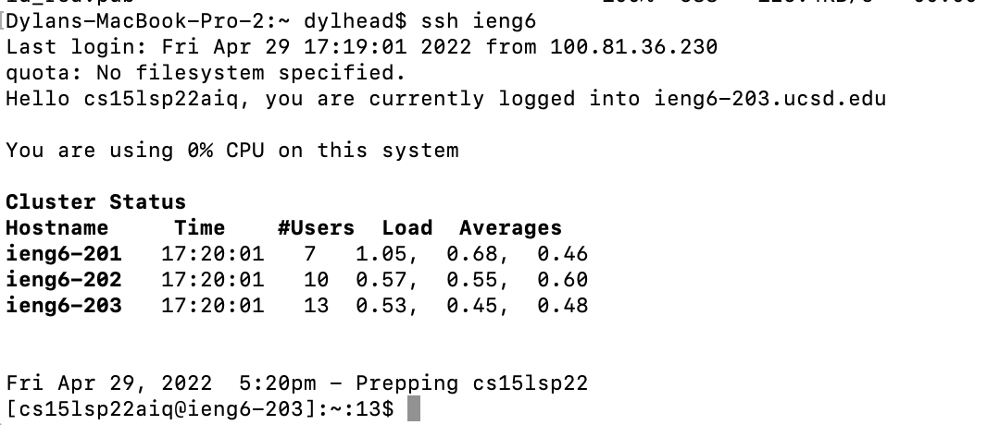
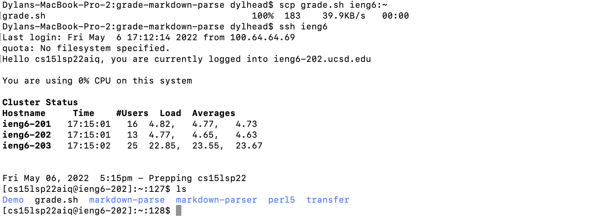
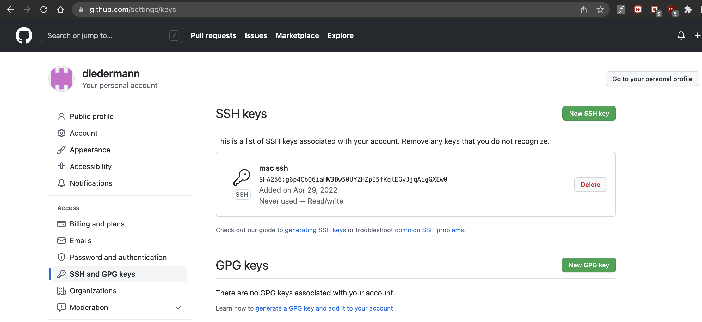
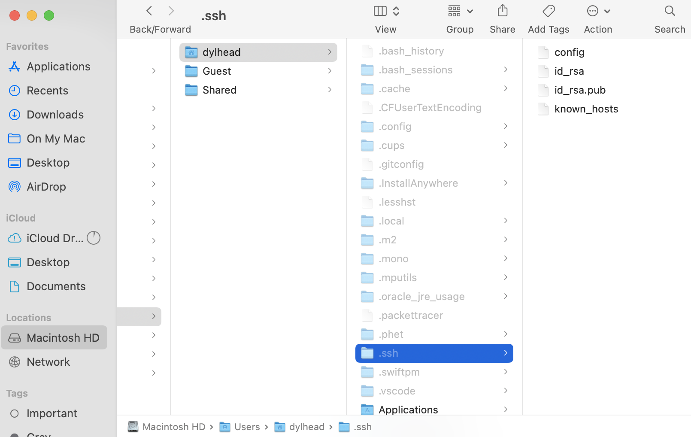
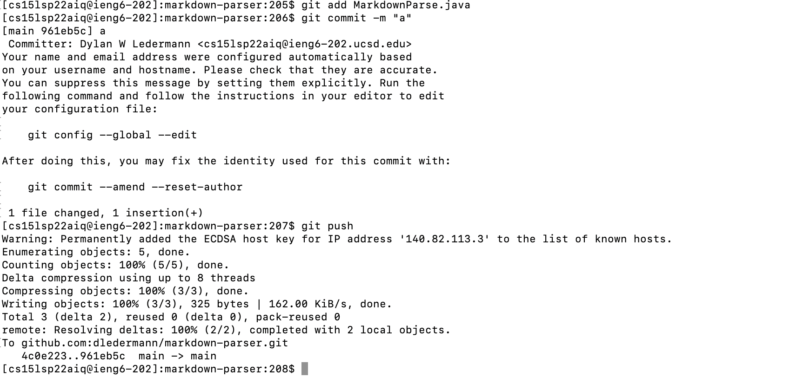
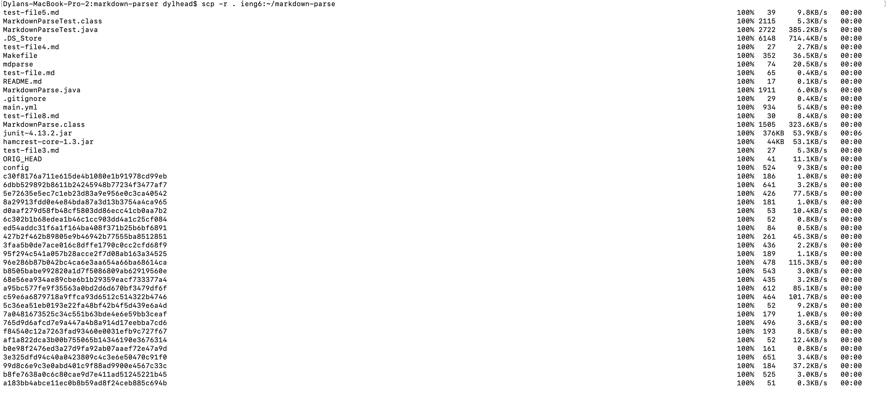
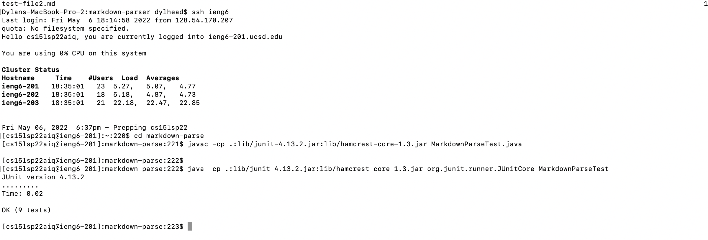
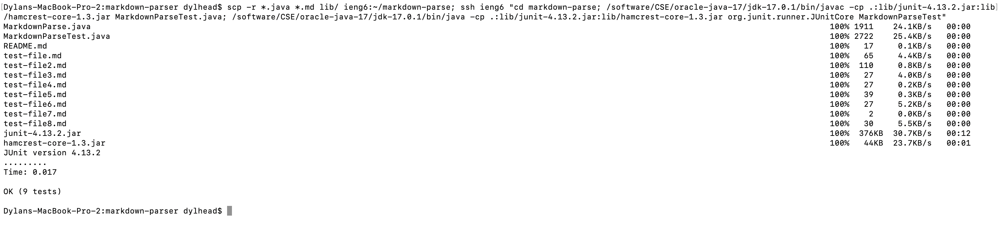

[Home](https://dledermann.github.io/cse15l-lab-reports/)

## Streamlining ssh Configuration


The .ssh/config file was edited using the nano command in the terminal.
```
$ nano ~/.ssh/config
```

 

Shows the server being logged into using the ieng6 alias that was set previously.



Shows the scp copying a file to the server using the alias ieng6.

## Setup Github Access from ieng6



public key stored in Github



private key stored on my computer



git commit and push used on ieng6 server

[Link to commit](https://github.com/dledermann/markdown-parser/commit/961eb5ceb91b594779e3f4f4502e789eb5853e68)

## Copy whole directories with scp -r



markdown-parse file being copied over to ieng6 account



markdown-parse file tests being compiled and ran on the ieng6 account



combination of scp , ;, and ssh beign used to scp the directory to ieng6 account, then compiling and running the tests.