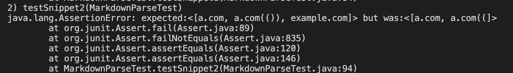
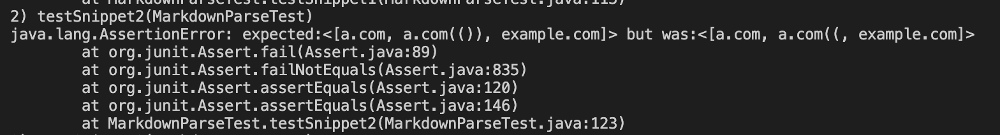
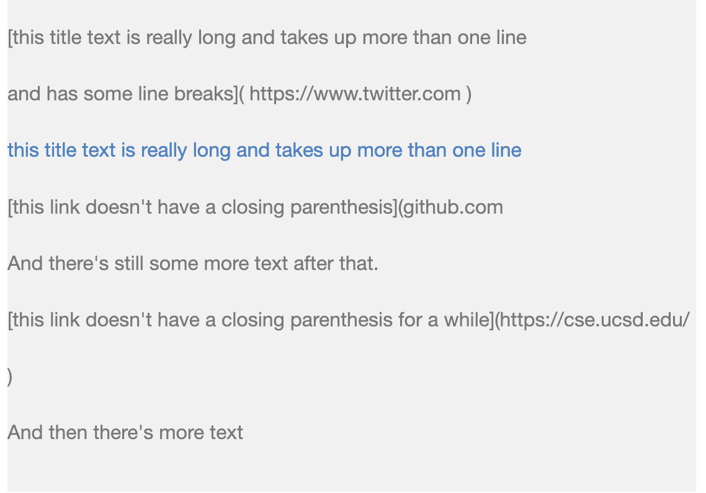
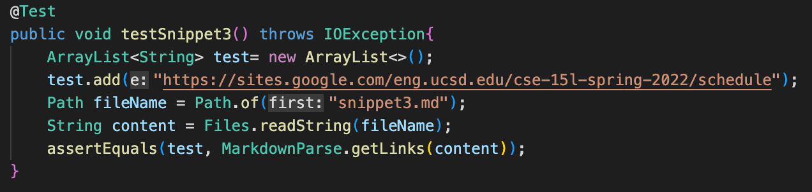
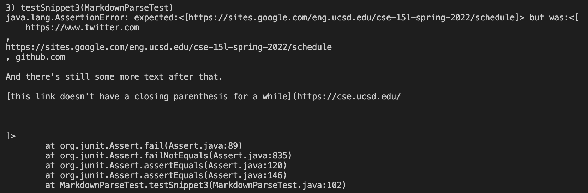
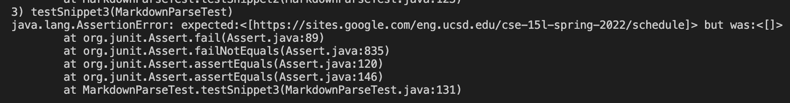

[Home](https://dledermann.github.io/cse15l-lab-reports/)

[My markdown-parse repository](https://github.com/dledermann/cse15l-lab-reports)

[Reviewed markdown-parse repository](https://github.com/mdsflyboy/markdown-parser)

## Snippet 1

What the test should produce:


Test in MarkdownParseTest.java:


Test output for my MarkdownParseTest.java:


The test did not pass. My code output `google.com and google.com links, but not the ucsd.edu link.

Test output for reviewed MarkdownParseTest.java:


The test did not pass. The code output url.com, `google.com, google.com, and ucsd.edu and it was not supposed to output url.com.

## Snippet 2

What the test should produce:


Test in MarkdownParseTest.java:


Test output for my MarkdownParseTest.java:



My code output a.com and a.com((, when it should've output a.com, a.com(()), and example.com.

Test output for reviewed MarkdownParsetest.java:



The test did not pass, it output a.com, a.com((, and example.com, when it should've output a.com, a.com(()), and example.com.

## Snippet 3

What the test should produce:



Test in MarkdownParse.java:



Test output for my MarkdownParse.java:



My code output the block:

```
    https://www.twitter.com
, 
https://sites.google.com/eng.ucsd.edu/cse-15l-spring-2022/schedule
, github.com

And there's still some more text after that.

[this link doesn't have a closing parenthesis for a while](https://cse.ucsd.edu/
```

when it should've output https://sites.google.com/eng.ucsd.edu/cse-15l-spring-2022/schedule.

Test output for reviewed MarkdownParsetest.java:



The test output nothing, there were no recognized links, when it should've output https://sites.google.com/eng.ucsd.edu/cse-15l-spring-2022/schedule.

## Code Changes

- Snippet 1

Yes, there is a small change I could make for the backtick problem. If I add an if statement that doesn't add the quote if the open bracket isn't after a new line.

- Snippet 2

No, adding code to catch nested links would take more than 10 lines of code, because you would have to add a mini loop that does what the current loop does to find linkes, but within brackets. This would mean adding adding lines to get the all the brackets and parenthesis within the mini loop, and get the link between the parenthesis, which would take more than 10 lines of code.

- Snippet 3

No, adding code to catch new lines and spaces would take more than 10 lines of code. The link only works if there are no spaces in the parenthesis and if there aren't more than 1 new line above or below the actual link. This would take a couple if statements to check whether these requirements are fulfilled and the extra spaces and new lines would have to be removed from the link, which would take more than 10 lines.

