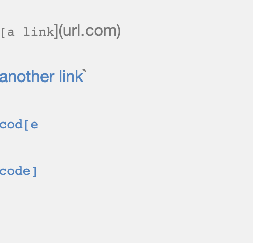
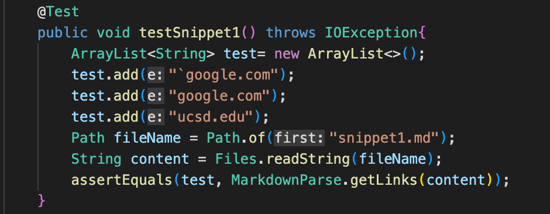
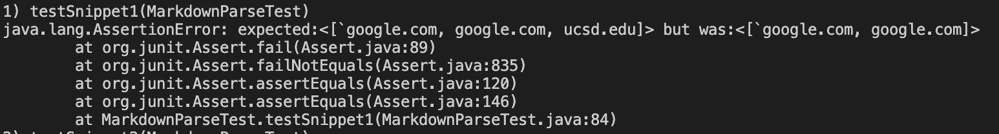
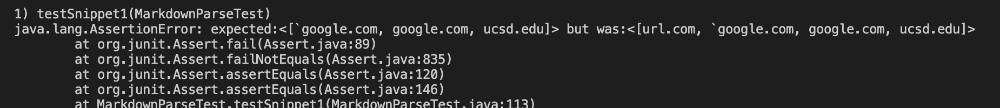
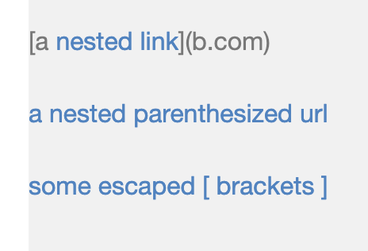
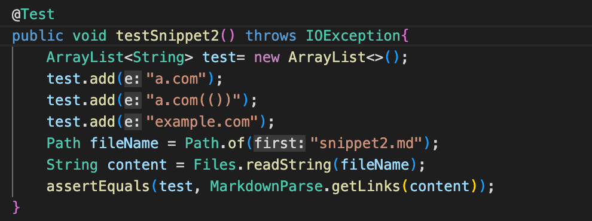

[Home](https://dledermann.github.io/cse15l-lab-reports/)

[My markdown-parse repository](https://github.com/dledermann/cse15l-lab-reports)

[Reviewed markdown-parse repository](https://github.com/mdsflyboy/markdown-parser)

## Snippet 1

What the test should produce:

Test in MarkdownParseTest.java:

Test output for my MarkdownParseTest.java:

The test did not pass. My code output `google.com and google.com links, but not the ucsd.edu link.

Test output for reviewed MarkdownParseTest.java:

The test did not pass. The code output url.com, `google.com, google.com, and ucsd.edu and it was not supposed to output url.com.

## Snippet 2

What the test should produce:

Test in MarkdownParseTest.java:

