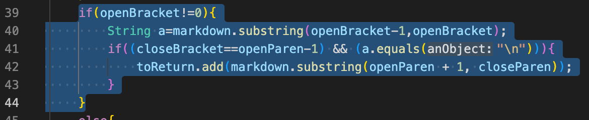

[Home](https://dledermann.github.io/cse15l-lab-reports/)

## Test File 432.md

I found that file 432.md had a different output for my MarkdownParse compared to the given MarkdownParse using the command:

```
vimdiff results.txt /home/linux/ieng6/cs15lsp22/cs15lsp22aiq/my-markdown-parser/results.txt
```

The command was used on the ieng6 server and in the folder that contained the MarkdownParse file that I made. This command compared the result.txt file from my program and compared it with the result.txt file from the given program and showed the differences in outputs.

[Link to test file 432.md](https://github.com/dledermann/markdown-parser/blob/main/test-files/432.md)

Different outputs(my program on the left and given program on the right):


Expected output:


The expected output should be the link "/url". My program aws wrong, because it found no link and the given program found the correct output. The problem with my program is that if there are any other characters on before the link, it doesn't count the link as valid. If I change this so that it checks if there is any special character before the link instead of any character, this problem would be fixed.

Code to be fixed:



## Test File 487.md

I found that file 487.md had a different output for my MarkdownParse compared to the given MarkdownParse using the command:

```
vimdiff results.txt /home/linux/ieng6/cs15lsp22/cs15lsp22aiq/my-markdown-parser/results.txt
```

The command was used on the ieng6 server and in the folder that contained the MarkdownParse file that I made. This command compared the result.txt file from my program and compared it with the result.txt file from the given program and showed the differences in outputs.

[Link to test file 487.md](https://github.com/dledermann/markdown-parser/blob/main/test-files/487.md)

Different outputs(my program on the left and given program on the right):


Expected output:


The expected output should be no link. My program got the link "/my uri", and the given program got no link, which is the correct output. The problem with my program is that it doesn't check if there are any spaces in the link, which would fix the problem. To fix this problem I could add something that gets the link that would be added, before it is added, and check if there are any spaces within the code. 

Code to be fixed: 


Before the code is added to the list that contains the links, the substringed link could be checked.